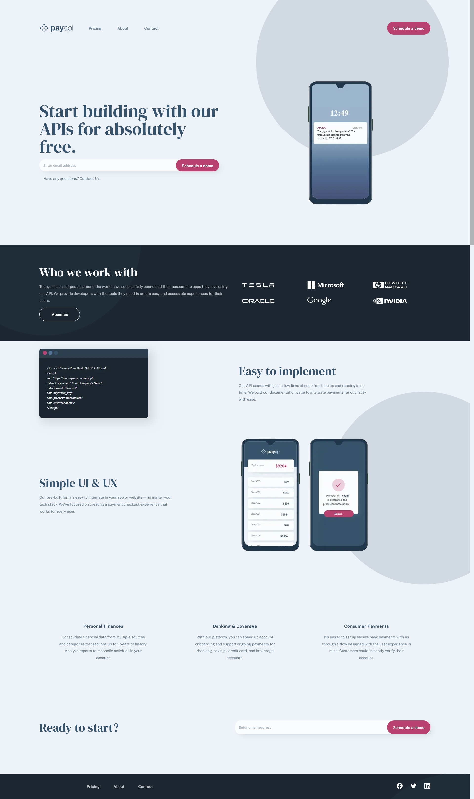

# Frontend Mentor - PayAPI multi-page website solution

This is a solution to the [PayAPI multi-page website challenge on Frontend Mentor](https://www.frontendmentor.io/challenges/payapi-multipage-website-FDLR1Y11e). Frontend Mentor challenges help you improve your coding skills by building realistic projects. 

## Table of contents

- [Overview](#overview)
  - [The challenge](#the-challenge)
  - [Screenshot](#screenshot)
  - [Links](#links)
- [My process](#my-process)
  - [Built with](#built-with)
  - [What I learned](#what-i-learned)
  - [Continued development](#continued-development)
  - [Useful resources](#useful-resources)
- [Author](#author)
- [Acknowledgments](#acknowledgments)

**Note: Delete this note and update the table of contents based on what sections you keep.**

## Overview

### The challenge

Users should be able to:

- View the optimal layout for each page depending on their device's screen size
- See hover states for all interactive elements throughout the site
- Receive an error message when the contact form is submitted if:
  - The `Name`, `Email Address` or `Message` fields are empty should show "This field can't be empty"
  - The `Email Address` is not formatted correctly should show "Please use a valid email address"

### Screenshot




### Links

- Solution URL: [PayAPI challenge](https://www.frontendmentor.io/challenges/payapi-multipage-website-FDLR1Y11e/hub)
- Live Site URL: [PayAPI](https://pay-api-seven.vercel.app/)

## My process

I started by analyzing the different design and look for things that I didn't know how to handle. I feel at ease with everything, except those circle background image and how to handle them responsivly. So I decided to keep it for the end.

I created my next.js project and added the different colors, font-size and fields elements. Then I started the first page, section by section, mobile to desktop and top to bottom.

After I did the same for the others pages : pricing, about, contact. Next I added the circle background image, struggle with it, ask help in the discord.

Finally I did a final review and some tweaking on padding and checked that everything was alright.

### Built with

- Semantic HTML5 markup
- CSS custom properties
- Flexbox
- CSS Grid
- Mobile-first workflow
- [React](https://reactjs.org/) - JS library
- [Next.js](https://nextjs.org/) - React framework

### What I learned

Use this section to recap over some of your major learnings while working through this project. Writing these out and providing code samples of areas you want to highlight is a great way to reinforce your own knowledge.

To see how you can add code snippets, see below:

```html
<h1>Some HTML code I'm proud of</h1>
```
```css
.proud-of-this-css {
  color: papayawhip;
}
```
```js
const proudOfThisFunc = () => {
  console.log('🎉')
}
```


**Note: Delete this note and replace the list above with resources that helped you during the challenge. These could come in handy for anyone viewing your solution or for yourself when you look back on this project in the future.**

## Author

- Website - [Thomas André-Lubin](https://www.thomasandrelubin.fr/)
- Frontend Mentor - [@Lordyner](https://www.frontendmentor.io/profile/Lordyner)
- Github - [@Lordyner](https://github.com/Lordyner)


## Acknowledgments

Thanks to @Grace-Snow (https://fedmentor.dev/) and @graiess073029 from the discord server for helping me to deal with those background circle.
